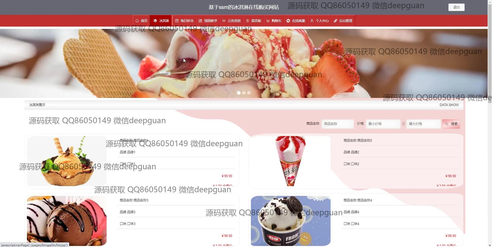
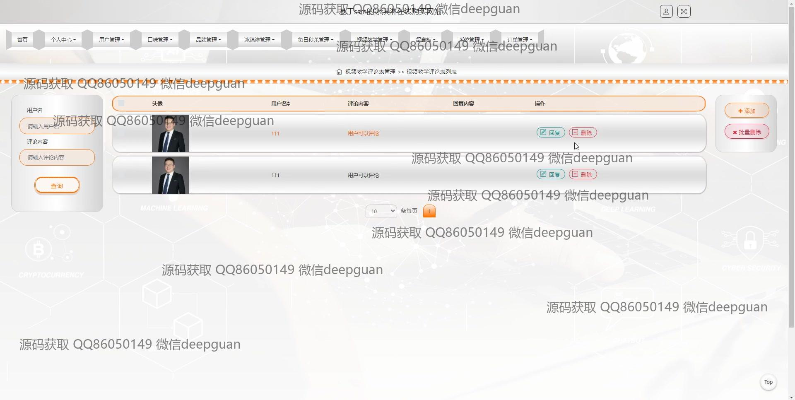
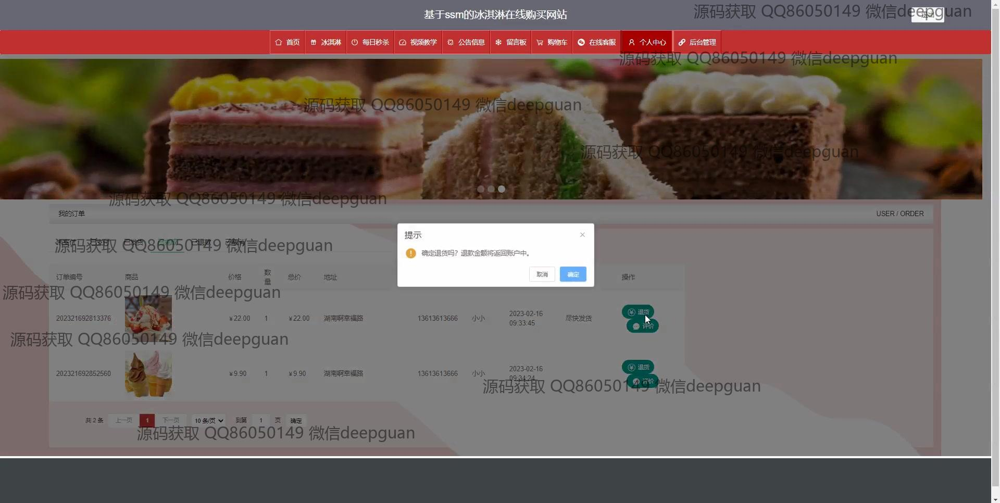
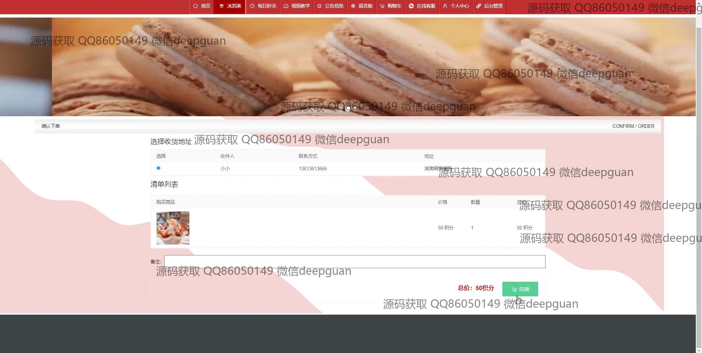

<h1 align="center">基于的冰淇淋在线购买网站</h1>

## 简介
冰淇淋在线购买网站：角色分为管理员、用户；支持商品管理、用户管理、订单管理、购物车功能、留言互动及评论管理。界面设计简洁，提升用户购物体验。    --计算机毕业设计源码；毕设源码；java毕业设计源码

## 联系方式

<h3 align="center">获取完整代码与数据库文件 + 微信：deepguan QQ: 86050149 QQ群: 783742310</h3>

<h3 align="center">可帮忙远程部署 包运行成功！提供远程部署、修改代码、设计文档指导、代码讲解等服务！</h3>

## 功能介绍（完整见运行截图）
管理员：  
基本功能：登录，注册，退出。  
网站首页：提供多个导航选项，支持用户管理、品牌管理、订单管理、首页内容更新等。  
商品管理：支持商品信息的新增、编辑、删除，包括商品编号、名称、口味、品牌、包装形式、价格和生产日期等，允许上传产品图片并编辑文字描述。  
订单管理：查看和管理用户订单，进行订单状态更新如未支付、已支付、已发货等。  
消息管理：管理用户留言和反馈，回复并上传图片，通过审核选项进行管理决策。  
轮播图和公告管理：上传和管理网站公告和轮播图片，支持在线更新和发布。  

用户：  
基本功能：登录，注册，退出。  
网站首页：通过主导航栏进行网站各模块的访问，包括每日推荐和冰淇淋分类。  
商品浏览和购买：查看冰淇淋产品详细信息，如价格、品牌、口味及评分，选择数量，加入购物车或立即购买，支持在线提交评论。  
个人中心：查看和编辑个人信息，管理收货地址，查看订单和收藏夹内容。  
购物体验：通过购物车查看已选择商品，调整数量或删除，支持在线客服进行即时沟通和问题解决。

## 运行截图

本代码来源于网络,仅供学习参考使用!

